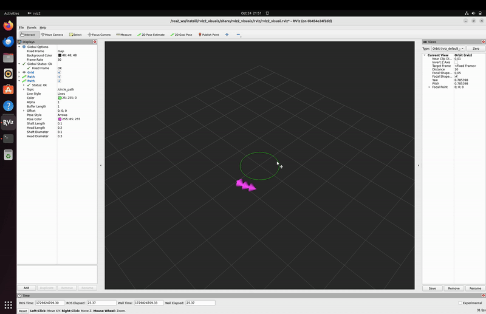

# RVIZ Visuals (rviz2_visuals) ROS2 Package

The `rviz2_visuals` package contains the RVIZ configuration files for visualizing some useful paths, or other kind of messages generated by nodes.



## Usage
```
ros2 launch rviz2_visuals rviz_visuals_launch.py
```

## Author
Alejandro Daniel José Gómez Flórez (@aldajo92)
