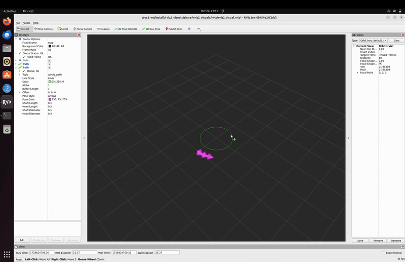

# RVIZ Visuals (rviz2_visuals) ROS2 Package

The `rviz2_visuals` package contains the RVIZ configuration files for visualizing some useful paths, or other kind of messages generated by nodes.



## What the launch file starts

`rviz_visuals_launch.py` brings up:

- A `static_transform_publisher` from `world` to `map` (zero offset).
- Four publisher nodes from this package:
  - `arrow_random` (node name `arrow_random_node`)
  - `circle_wave` (node name `circle_wave_node`)
  - `circle_path` (node name `circle_path_node`)
  - `image_publisher` (node name `image_publisher_node`)
- `rviz2` loaded with `rviz/rviz2_visual.rviz`, only when `use_rviz` is `true`.

## Launch arguments

| Argument   | Default | Description                  |
| ---------- | ------- | ---------------------------- |
| `use_rviz` | `true`  | Whether to launch RViz2.     |

## Usage

Build the package:

```bash
colcon build --packages-select rviz2_visuals
```

Launch with RViz2 (default):

```bash
ros2 launch rviz2_visuals rviz_visuals_launch.py
```

Launch the publishers without RViz2 (useful when RViz2 runs elsewhere, e.g. on the host):

```bash
ros2 launch rviz2_visuals rviz_visuals_launch.py use_rviz:=false
```

## Author
Alejandro Daniel José Gómez Flórez (@aldajo92)
